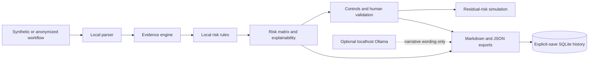

# AI Workflow Risk Auditor Pro

Local-first Streamlit tool to explain, score, simulate, and document AI workflow risks before automation.


AI Workflow Risk Auditor Pro reviews synthetic or anonymized workflow descriptions using inspectable local rules. It shows the evidence behind each finding, calculates deterministic risk indicators, recommends controls, simulates residual risk, and exports Markdown and JSON reports.

This is not a certification. Scores are rule-based estimates, not statistical probabilities.

## In one minute

Paste an anonymized workflow or choose a synthetic scenario, then run an audit. The app breaks the workflow into steps, detects locally defined risk evidence, maps that evidence to weighted factors, explains the score, and proposes human review points and controls. You can simulate selected controls without changing the original result, download a report immediately, or explicitly save it to local SQLite history.

Use the app to ask:

- What evidence in this workflow deserves review?
- Which deterministic rule matched, and how did it affect the score?
- Which actions should remain human-approved?
- Which controls could be considered, and what residual score do they simulate?
- How can the review be documented without sending the workflow to a cloud service?

## Why this project exists

Teams increasingly add AI to customer support, hiring, security operations, logistics, and internal processes. Before connecting those workflows to production, reviewers need an understandable way to discuss sensitive data, privacy, cybersecurity, autonomy, human oversight, and auditability. This project provides a local, reproducible review aid for that early design stage.

It is intended for security and privacy practitioners, AI governance teams, technical product managers, auditors, architects, educators, and developers evaluating proposed AI-assisted workflows.

## Key features

- Deterministic analyzer with inspectable risk rules and fixed score thresholds.
- Step-level evidence, sensitive-data detection, cybersecurity/privacy findings, and human checkpoints.
- Explainable risk matrix with likelihood, impact, confidence, severity, and score impact.
- Top risks, top actions, recommended controls, and residual-risk simulation.
- Dashboard with KPI cards, heatmap, matrix, workflow graph, evidence drill-down, local follow-up items, control checklist, and saved-history views.
- Markdown and JSON exports, sample reports, and explicit-save SQLite history.
- Read-only Knowledge Base with 120 risk patterns, 40 controls, 10 data categories, 20 demo scenarios, 25 explanation cards, and 20 workflow templates.
- English, French, and Hebrew UI catalogs with key parity and RTL-aware Hebrew presentation.
- Light, Dark, and System appearance selector; System currently uses the light palette.
- Optional localhost-only Ollama narrative assistance with remote endpoint and cloud/proxy model blocking.

The UI labels outputs as Detected, Calculated, Simulated, Recommended, or Uncertain. Numbers are shown with their source, meaning, and limitation instead of appearing without context.

## Screenshots

Public screenshots are intentionally not committed until a final human visual and privacy review is complete.

| Planned view | File |
|---|---|
| Home audit | `screenshots/01_home_audit.png` |
| Score explainability | `screenshots/02_score_explainability.png` |
| Dashboard overview | `screenshots/03_dashboard_overview.png` |
| Risk heatmap | `screenshots/04_risk_heatmap.png` |
| Evidence drill-down | `screenshots/05_evidence_drilldown.png` |
| Local AI / Ollama | `screenshots/06_local_ai_ollama.png` |
| Reports preview | `screenshots/07_reports_preview.png` |
| Knowledge Base | `screenshots/08_knowledge_base.png` |
| French UI | `screenshots/09_french_ui.png` |
| Hebrew RTL UI | `screenshots/10_hebrew_rtl_ui.png` |

See [the screenshot capture specification](docs/SCREENSHOTS_TODO.md) before adding images.

## How scoring works

The analyzer and evidence engine run locally. Matched evidence maps to fixed risk factors in `risk_rules.py`; factor weights are summed into deterministic scores and mapped to fixed severity thresholds:

- 0–4: low
- 5–9: medium
- 10–15: high
- 16+: critical

The report distinguishes the original compatibility score from the evidence-based raw matrix score. Finding count is a count of detected attention points, not proof of harm. Residual risk is a local simulation of mapped control effects, not a guarantee that a real control was implemented or effective.

The score does not represent a probability, calibrated loss estimate, legal conclusion, compliance status, production approval, or permission to automate. A human must review the workflow, evidence, assumptions, and applicable obligations.

See [Score Explainability](docs/SCORE_EXPLAINABILITY.md) and [Score Calculation Trace](docs/SCORE_CALCULATION_TRACE.md).

## Local-first privacy model

- Deterministic analysis uses local Python code and local JSON knowledge files.
- User workflow text is not written to SQLite during analysis; saving requires an explicit UI action.
- Downloads are generated without creating history.
- Saved projects, workflows, assessments, simulations, reports, and audit events stay in project-local `data/aiwra.db`.
- The runtime database, virtual environments, caches, logs, environment files, and Streamlit secrets are ignored by Git.
- No cloud API, vendor key, telemetry, external database, or production-system connection is required.
- Use synthetic or anonymized input. Do not paste real secrets or sensitive production data.

Full boundaries are documented in [Privacy Model](docs/PRIVACY_MODEL.md) and [Security](SECURITY.md).

## Optional Local AI / Ollama

Ollama is optional. The app accepts only `localhost`, `127.0.0.1`, or `::1` endpoints and blocks cloud/proxy-like model names or metadata. It can run a synthetic local test or draft a narrative for the current report after an explicit click.

Ollama can assist with wording. It does not create rules, alter findings, calculate or validate scores, choose controls, change residual-risk simulation, certify compliance, or become a test prerequisite. If it is unavailable or a model is rejected, the deterministic report remains available.

## Architecture



The application is a single local Streamlit process with Python domain modules, JSON knowledge files, and SQLite persistence. See [Architecture](docs/ARCHITECTURE.md), [Data Model](docs/DATA_MODEL.md), and [Source of Truth Map](docs/SOURCE_OF_TRUTH_MAP.md).

## Installation

Prerequisites: Python 3.12 and a local shell. Ollama is not required.

```bash
git clone <REPOSITORY_URL> ai-workflow-risk-auditor-pro
cd ai-workflow-risk-auditor-pro
python3 -m venv .venv
source .venv/bin/activate
python -m pip install -r requirements.txt
```

See [Installation](docs/INSTALLATION.md) for Windows activation, local data reset, and troubleshooting.

## Run locally

```bash
streamlit run app.py --server.address 127.0.0.1
```

Open the local URL printed by Streamlit. The app creates `data/aiwra.db` on first run; that file is ignored by Git.

See [Usage](docs/USAGE.md) for the complete first-run flow, input safety, evidence, simulation, exports, local saves, and optional Ollama behavior.

## Tests

```bash
python -m pytest
python -m compileall app.py analyzer.py database.py repositories.py workflow_parser.py report_renderer.py export_json.py score_explainability.py design_tokens.py ui_components.py tests locales
```

The suite covers deterministic analysis, rules, evidence, controls, residual simulation, SQLite persistence, exports, localization parity, RTL report rendering, UI component data helpers, theme tokens, optional-Ollama guardrails, and the no-cloud-SDK dependency boundary. CI does not require Ollama, internet APIs, secrets, or an existing database.

## Five-minute demo

1. Start the app and select a synthetic Customer Support scenario.
2. Run the audit and explain the Detected / Calculated / Simulated / Recommended / Uncertain legend.
3. Open a finding to show its source evidence, rule, confidence, and recommended control.
4. Open the score basis and risk matrix.
5. Simulate selected controls and state that residual risk is simulated, not guaranteed.
6. Download Markdown and JSON without saving.
7. Explicitly save the report, then show Dashboard and Reports history.
8. Browse the Knowledge Base and switch to French or Hebrew RTL.
9. Optionally show the Local AI tab; the core demo must work with Ollama unavailable.

See [Public Demo Guide](docs/PUBLIC_DEMO_GUIDE.md) and [Demo Script](docs/DEMO_SCRIPT.md).

## Sample reports and examples

- [Customer support report](sample_reports/customer_support_report.md)
- [HR candidate screening report](sample_reports/hr_candidate_screening_report.md)
- [Logistics operations report](sample_reports/logistics_operations_report.md)
- [SOC alert triage report](sample_reports/soc_alert_triage_report.md)
- [Customer support input](docs/examples/customer_support_input.txt)
- [Example Markdown report](docs/examples/customer_support_report.md)
- [Example JSON report](docs/examples/customer_support_report.json)

## Documentation

Use the [documentation index](docs/README.md) to navigate installation, usage, architecture, privacy, security, scoring, validation, visual design, Local AI, examples, and presentation guidance. Contributions are described in [CONTRIBUTING.md](CONTRIBUTING.md); report security issues using [SECURITY.md](SECURITY.md).

## Limitations

- Pattern and keyword matching can miss context or produce false positives.
- Confidence values are deterministic heuristics, not empirical confidence probabilities.
- Control effectiveness and residual-risk reductions are planning assumptions.
- French and Hebrew catalogs have key parity, but professional translation review can still improve wording.
- Hebrew is RTL-aware, while code, JSON, endpoint, model, and diagnostic blocks remain LTR.
- System theme selection currently resolves to the light palette.
- The app does not connect to or control email, HR, CRM, SIEM, SOAR, cloud, finance, ticketing, or other production systems.
- It does not execute actions, remediate findings, perform vulnerability scanning, or replace legal, privacy, security, or governance review.

## Roadmap

See [ROADMAP.md](ROADMAP.md). Near-term work includes public screenshot capture and visual QA, deeper language review, more synthetic scenarios, optional PDF export, and selective CI expansion. The project remains local-first and does not become SaaS by default.

## Security and responsible use

Use only synthetic or appropriately anonymized workflows. Do not put secrets or personal data in public issues, screenshots, reports, or examples. Report vulnerabilities privately using the process in [SECURITY.md](SECURITY.md). Contributions must preserve deterministic score explainability and the documented local-first boundary.

## License

Licensed under the [MIT License](LICENSE).
