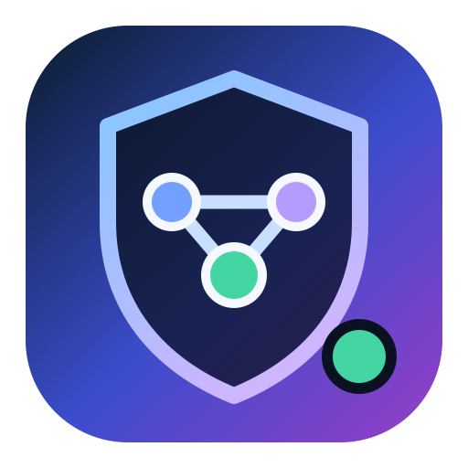
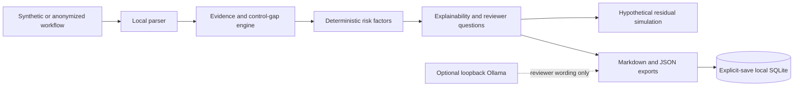

# AI Workflow Risk Auditor Pro

<p align="center">
  
</p>

**A local-first AI risk command center for deterministic review of AI-assisted workflows before automation.**

[](https://github.com/GhostInTheShell-444/ai-workflow-risk-auditor-pro-public/actions/workflows/ci.yml)


[](LICENSE)

> **Official public repository:** `GhostInTheShell-444/ai-workflow-risk-auditor-pro-public`
>
> Public for review, transparency, and non-commercial evaluation. Commercial use, hosted clones, redistribution, rebranding, and competing derivative products require prior written permission.


AI Workflow Risk Auditor Pro turns a synthetic or anonymized workflow description into an engine-aware audit cockpit: inspectable evidence, deterministic risk factors, review-priority scoring, mapped controls, hypothetical residual-risk simulation, and local Markdown/JSON reports.

It is a review aid. It is not a probability model, compliance certification, legal opinion, production approval, or automatic remediation system.

## Why this exists

AI workflows can begin drafting messages, changing records, approving refunds, ranking people, calling tools, or handling sensitive data before governance catches up. Teams need a local way to ask:

- What data and impact areas are present?
- Is AI advising a reviewer or acting autonomously?
- Which wording triggered each finding?
- Which controls are stated, missing, or still unproven?
- What must a human verify before production use?

## What it does

- **Command:** presents the current score, severity, finding count, human-review state, local-only boundary, save state, and simulation state in one risk cockpit.
- **Explain:** shows source evidence, rule ID, severity, confidence heuristic, score impact, why it matters, limitations, and reviewer questions.
- **Score:** sums fixed local risk-factor weights into Low (0–4), Medium (5–9), High (10–15), or Critical (16+).
- **Simulate:** applies only mapped control reductions and shows assumptions, evidence required, implementation checks, remaining factors, and human-review status.
- **Document:** creates deterministic Markdown and JSON exports with stable technical keys.
- **Save explicitly:** writes local SQLite history only after the user selects the save action.
- **Review with optional local AI:** uses loopback-only Ollama for wording, missing-context prompts, evidence summaries, and challenge questions.

## What it does not do

- No compliance certification or conformity assessment.
- No legal advice or regulatory conclusion.
- No statistical probability or calibrated loss estimate.
- No production approval or production-system integration.
- No automatic remediation, execution, or vulnerability scanning.
- No proof that a selected control exists or works.
- No cloud requirement and no cloud fallback.
- No replacement for qualified human review.

## Local-first privacy model

- Deterministic analysis uses local Python modules and local JSON knowledge files.
- Workflow text remains in the active Streamlit session unless the user explicitly saves.
- Explicit saves write to project-local `data/aiwra.db`.
- Downloads do not require saving.
- No cloud API, vendor key, telemetry service, remote database, or hidden analytics is required.
- Optional Ollama calls accept only `localhost`, `127.0.0.1`, or `::1`.
- Redirects and environment proxy use are disabled for Ollama requests.
- Cloud/proxy-like model names and non-loopback endpoints are rejected.

Use synthetic or appropriately anonymized workflow text. Do not paste real credentials, secrets, regulated records, confidential documents, private source code, or production data.

## Risk engine v2

The deterministic engine covers:

- **Data sensitivity:** synthetic/anonymized, personal, customer, employee, candidate, financial, refund/payment, health, legal/compliance, confidential, credentials, source code, and private documents.
- **Automation autonomy:** draft-only assistance, human review, monitoring, automatic communication/action, financial decisions, account/access decisions, full autonomy, and fallback behavior.
- **Impact:** customer communication, finance, account/access/security, legal, HR, health, operations, internal productivity, and vendor/cloud exposure.
- **Governance:** approval, reviewer identity, escalation, audit trail, retention, appeal/recourse, monitoring, rollback/fallback, access control, minimization, masking, change management, and incident handling.
- **AI-specific risk:** prompt injection, untrusted input, tool use, hallucination-sensitive output, missing grounding, confidence misuse, cloud/proxy dependency, model provenance, model decision authority, external destinations, and opaque logic.

Findings are deterministic text signals. Missing-control findings mean the submitted description did not provide evidence; they do not prove the real control is absent.

Confidence is a repeatable heuristic based on rule severity and match type. It is not empirical confidence. Framework mappings are framework-inspired review categories only and do not claim certification.

See [Score Explainability](docs/SCORE_EXPLAINABILITY.md), [Score Calculation Trace](docs/SCORE_CALCULATION_TRACE.md), and the local v2 knowledge files under [`knowledge_base/`](knowledge_base/).

## Residual-risk simulation

Selected controls are hypothetical unless implementation evidence proves otherwise. For each selected control, the simulation exposes:

- mapped factors;
- estimated score reduction;
- implementation assumption;
- evidence required;
- implementation check;
- limitation;
- explicit “not proof of implementation” warning.

Unrelated factors are not reduced, scores cannot fall below zero, and High/Critical residual states require human review. The result is a planning estimate, not real-world assurance.

## Local AI reviewer role

Optional local AI acts as a bounded reviewer assistant. It may:

- draft executive wording;
- summarize deterministic evidence;
- identify missing context;
- propose reviewer and challenge questions;
- explain why human review remains necessary.

It cannot change the deterministic analysis object, findings, score, recommended controls, or residual-risk math. The exact prompt is shown before an explicit local call, and output is displayed separately from deterministic results. If Ollama is unavailable, the deterministic application remains complete.

See [Local AI / Ollama](docs/LOCAL_AI_OLLAMA_TAB.md).

## Visual command center

- Light, Dark, and operating-system-aware themes use local CSS tokens only.
- Severity drives cockpit borders, score emphasis, finding cards, and simulation states; labels and symbols remain present so color is never the only signal.
- High and Critical findings receive stronger evidence-card treatment without changing engine weights or thresholds.
- Buttons, inputs, expanders, tables, tabs, sidebar controls, warnings, and disabled states share the same token layer.
- Motion is limited to subtle status and hover feedback and is disabled by `prefers-reduced-motion`.
- English, French, and Hebrew RTL use the same engine result structure.

## Screenshots

### English primary flow


### Internationalization proof


The screenshots use bundled synthetic workflows and were normalized for the public README gallery. Re-run the screenshot gate before replacing them: dimensions, metadata, visible text, privacy, local-only boundaries, and README path accuracy all remain publication checks. See [Screenshot Guidelines](docs/SCREENSHOT_GUIDELINES.md) and [Screenshot Capture Specification](docs/SCREENSHOTS_TODO.md).

## Quick start

Prerequisites: Git and Python 3.12. Ollama is optional.

Linux or macOS:

```bash
git clone https://github.com/GhostInTheShell-444/ai-workflow-risk-auditor-pro-public.git
cd ai-workflow-risk-auditor-pro-public
python3 -m venv .venv
source .venv/bin/activate
python -m pip install -r requirements.txt
python -m streamlit run app.py --server.address 127.0.0.1
```

Windows PowerShell:

```powershell
git clone https://github.com/GhostInTheShell-444/ai-workflow-risk-auditor-pro-public.git
Set-Location ai-workflow-risk-auditor-pro-public
py -3.12 -m venv .venv
.\.venv\Scripts\Activate.ps1
python -m pip install -r requirements.txt
python -m streamlit run app.py --server.address 127.0.0.1
```

Open `http://127.0.0.1:8501`.

### Optional desktop launcher

Linux is supported first. After the normal installation succeeds:

```bash
.venv/bin/python scripts/install_desktop_launcher.py
```

This creates a user-local application launcher under `~/.local/share/applications/`, uses the local SVG icon, starts Streamlit on `127.0.0.1:8501`, and writes startup logs under `${XDG_STATE_HOME:-$HOME/.local/state}/aiwra/`. It does not use `sudo` or install system-wide files. Logs are private runtime artifacts and must be reviewed before sharing.

To also create a shortcut on an existing `~/Desktop`:

```bash
.venv/bin/python scripts/install_desktop_launcher.py --desktop
```

Remove both expected launcher locations:

```bash
.venv/bin/python scripts/install_desktop_launcher.py --uninstall
```

Windows and macOS user-local helper scripts are included. macOS support is documented but was not tested in this Linux implementation pass. See [Desktop Launcher](docs/DESKTOP_LAUNCHER.md) and [Installation](docs/INSTALLATION.md).

Run validation:

```bash
python -m pytest
python -m compileall -q app.py analyzer.py database.py repositories.py workflow_parser.py report_renderer.py export_json.py score_explainability.py design_tokens.py ui_components.py tests locales
python -m pip check
```

See [Installation](docs/INSTALLATION.md), [Desktop Launcher](docs/DESKTOP_LAUNCHER.md), [Usage](docs/USAGE.md), [FAQ](docs/FAQ.md), and [Synthetic Examples](examples/README.md).

## Architecture



## Limitations

- Pattern matching can miss context and produce false positives.
- Missing-control findings infer absence from submitted wording, not from production evidence.
- Factor weights and thresholds are deterministic review-priority choices, not scientific validation.
- SQLite is local and not encrypted by this application.
- The app has no authentication, authorization, or tenant isolation.
- Optional local-model output can be inaccurate and always requires review.
- Reports and screenshots can reproduce submitted text; inspect them before sharing.
- Bind Streamlit to `127.0.0.1` on a trusted machine.
- Native review of Hebrew wording remains recommended.

## License

Released under the [source-available non-commercial license](LICENSE).

- [NOTICE.md](NOTICE.md)
- [Licensing and commercial use](docs/LICENSING_AND_COMMERCIAL_USE.md)
- Official clone URL: `https://github.com/GhostInTheShell-444/ai-workflow-risk-auditor-pro-public.git`

There is no release, tag, package, or compliance certification implied by this repository.
