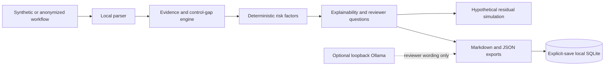

# AI Workflow Risk Auditor Pro

**Local-first AI workflow risk review before automation.**

AIWRA helps reviewers inspect AI-assisted workflows before they become operational automations.
It turns synthetic or anonymized workflow descriptions into explainable findings,
deterministic review-priority scores, mapped controls, residual-risk simulations,
and local exportable reports.

[](https://github.com/GhostInTheShell-444/ai-workflow-risk-auditor-pro-public/actions/workflows/ci.yml)


[](LICENSE)

> **Official public repository**
> `GhostInTheShell-444/ai-workflow-risk-auditor-pro-public`
>
> Public for review, transparency, and non-commercial evaluation.
> Commercial use, hosted clones, redistribution, rebranding, or competing derivative products
> require prior written permission.


## At a glance

| Area | What AIWRA provides |
|---|---|
| **Purpose** | Review AI-assisted workflows before automation. |
| **Execution model** | Local Streamlit application bound to loopback. |
| **Risk logic** | Deterministic rules, explicit factors, fixed scoring thresholds. |
| **Evidence** | Matched workflow text, rule IDs, explanations, limitations, and reviewer questions. |
| **Controls** | Recommended safeguards and hypothetical residual-risk reductions. |
| **Exports** | Local Markdown and JSON reports. |
| **Local AI** | Optional Ollama reviewer assistance only; never score authority. |
| **Languages** | English, French, and Hebrew RTL presentation support. |

## Why this matters

AI workflows can quietly move from assistance to automation:

drafting customer messages, approving refunds, ranking candidates, handling confidential records,
calling tools, or making access-related decisions before governance is mature.

AIWRA gives a reviewer a local cockpit to ask:

- What sensitive data appears in the workflow?
- Which autonomy and impact areas are present?
- Which exact wording triggered each finding?
- Which controls are stated, missing, or still unproven?
- What remains risky after hypothetical controls are selected?
- What must a human verify before any production decision?

## What makes it different

AIWRA is designed around a strict boundary:

**the deterministic engine is the source of truth.**

A local model can help with wording, summaries, challenge questions, or missing-context prompts,
but it cannot change findings, scores, controls, or residual-risk math.

| Differentiator | Practical effect |
|---|---|
| **Local-first** | No cloud API, remote database, hidden telemetry, or vendor key is required. |
| **Deterministic scoring** | The same workflow signals produce repeatable review-priority results. |
| **Evidence-first review** | Findings point back to matched wording and explain why it matters. |
| **Control mapping** | Simulations show assumptions, required evidence, and remaining factors. |
| **Non-certifying posture** | The tool helps review; it does not approve, certify, or replace qualified judgment. |
| **RTL-aware presentation** | Hebrew layout is treated as a first-class UI concern, not an afterthought. |

## What AIWRA does

### Command

Shows the current score, severity, finding count, human-review state,
local-only boundary, save state, and simulation state in one cockpit.

### Explain

Displays matched evidence, rule identifiers, severity, confidence heuristic,
score impact, limitations, and reviewer questions.

### Score

Uses fixed local factor weights and deterministic thresholds:

| Band | Score range | Meaning |
|---|---:|---|
| Low | 0–4 | Fewer detected review factors. |
| Medium | 5–9 | Meaningful review needed before automation. |
| High | 10–15 | Strong review priority and control validation required. |
| Critical | 16+ | High-risk automation posture; human review is mandatory. |

The score is a review-priority signal, not probability, loss estimate, certification,
or permission to automate.

### Simulate

Applies only mapped control reductions and shows:

- control assumptions;
- mapped factors;
- estimated score reduction;
- evidence required;
- implementation checks;
- limitations;
- remaining risk factors.

A simulated lower score does not prove a control exists, works, or is sufficient.

### Document

Generates deterministic Markdown and JSON exports with stable technical keys.
Reports may contain submitted text and matched evidence; review them before sharing.

### Save explicitly

Workflow text is not added to history until the user explicitly saves the analysis.
Saved history is stored in the local SQLite database under `data/aiwra.db`.

### Review with optional local AI

Ollama can be used as a local reviewer assistant for wording and challenge questions.
It is optional and restricted to loopback endpoints.

## What AIWRA does not do

AIWRA intentionally does **not** provide:

- compliance certification or conformity assessment;
- legal advice or regulatory conclusion;
- production approval;
- statistical probability or calibrated financial loss;
- automatic remediation, vulnerability scanning, or tool execution;
- proof that a selected control exists or works;
- cloud fallback;
- replacement for qualified human review.

## Local-first privacy model

Deterministic analysis runs through local Python modules and local JSON knowledge files.

By design:

- workflow text remains in the active Streamlit session unless explicitly saved;
- explicit saves write to project-local `data/aiwra.db`;
- downloads do not require saving;
- deterministic analysis needs no cloud account, API key, remote database, or telemetry;
- optional Ollama calls accept only `localhost`, `127.0.0.1`, or `::1`;
- redirects and environment proxy use are disabled for Ollama requests;
- cloud/proxy-like model names and non-loopback endpoints are rejected.

Use synthetic or appropriately anonymized workflow text.
Do not paste real credentials, secrets, regulated records, confidential documents,
private source code, or production data.

## Risk engine v2

The deterministic engine checks workflow wording against local knowledge sources.
It covers the following review areas.

### Data sensitivity

- synthetic or anonymized data;
- personal, customer, employee, and candidate data;
- financial, refund, payment, health, legal, and compliance contexts;
- confidential material, credentials, source code, and private documents.

### Automation autonomy

- draft-only assistance;
- human review;
- monitoring;
- automatic communication or action;
- financial decisions;
- account, access, or security decisions;
- full autonomy and fallback behavior.

### Impact areas

- customer communication;
- finance;
- account, access, and security;
- legal;
- HR;
- health;
- operations;
- internal productivity;
- vendor or cloud exposure.

### Governance controls

- approval;
- reviewer identity;
- escalation;
- audit trail;
- retention;
- appeal or recourse;
- monitoring;
- rollback or fallback;
- access control;
- minimization;
- masking;
- change management;
- incident handling.

### AI-specific risk

- prompt injection;
- untrusted input;
- tool use;
- hallucination-sensitive output;
- missing grounding;
- confidence misuse;
- cloud or proxy dependency;
- model provenance;
- model decision authority;
- external destinations;
- opaque logic.

Findings are deterministic text signals.
Missing-control findings mean the submitted description did not provide evidence;
they do not prove the real control is absent.
Confidence is a repeatable heuristic based on rule severity and match type.
It is not empirical confidence.

See also:

- [Score Explainability](docs/SCORE_EXPLAINABILITY.md)
- [Score Calculation Trace](docs/SCORE_CALCULATION_TRACE.md)
- [`knowledge_base/`](knowledge_base/)

## Residual-risk simulation

Selected controls are hypothetical unless implementation evidence proves otherwise.

For each selected control, AIWRA exposes:

- mapped factors;
- estimated score reduction;
- implementation assumption;
- evidence required;
- implementation check;
- limitation;
- explicit “not proof of implementation” warning.

Unrelated factors are not reduced.
Scores cannot fall below zero.
High and Critical residual states continue to require human review.

## Optional Local AI / Ollama

Ollama support is optional.
The deterministic application remains complete if Ollama is not installed.

When enabled, local AI may help draft:

- executive wording;
- deterministic evidence summaries;
- missing-context prompts;
- reviewer questions;
- challenge questions;
- reminders about human review.

Local AI cannot modify:

- the deterministic analysis object;
- findings;
- score;
- recommended controls;
- residual-risk simulation.

The exact prompt is shown before an explicit local call,
and the generated response is displayed separately from deterministic results.

See [Local AI / Ollama](docs/LOCAL_AI_OLLAMA_TAB.md).

## Visual command center

AIWRA includes a public-ready review cockpit:

- Light, Dark, and System themes use local CSS tokens.
- Severity drives cockpit borders, score emphasis, finding cards, and simulation states.
- Labels and symbols remain visible so color is never the only signal.
- High and Critical findings receive stronger visual priority without changing engine math.
- Buttons, inputs, expanders, tables, tabs, sidebar controls, warnings, and disabled states
  share the same token layer.
- Motion is limited to subtle status and hover feedback and respects `prefers-reduced-motion`.
- English, French, and Hebrew RTL use the same deterministic result structure.

## Screenshot gallery

The gallery uses bundled synthetic workflows normalized for public review.

### Primary English flow


### Internationalization proof


Before replacing screenshots, re-run the screenshot gate and verify dimensions,
metadata, visible text, privacy, local-only boundaries, and README path accuracy.

See:

- [Screenshot Guidelines](docs/SCREENSHOT_GUIDELINES.md)
- [Screenshot Capture Specification](docs/SCREENSHOTS_TODO.md)

## Quick start

### Requirements

- Git
- Python 3.12
- Current desktop browser
- Optional: Ollama for local reviewer assistance

### Linux or macOS

```bash
git clone https://github.com/GhostInTheShell-444/ai-workflow-risk-auditor-pro-public.git
cd ai-workflow-risk-auditor-pro-public

python3 -m venv .venv
source .venv/bin/activate

python -m pip install --upgrade pip
python -m pip install -r requirements.txt
python -m streamlit run app.py --server.address 127.0.0.1
```

### Windows PowerShell

```powershell
git clone https://github.com/GhostInTheShell-444/ai-workflow-risk-auditor-pro-public.git
Set-Location ai-workflow-risk-auditor-pro-public

py -3.12 -m venv .venv
.\.venv\Scripts\Activate.ps1

python -m pip install --upgrade pip
python -m pip install -r requirements.txt
python -m streamlit run app.py --server.address 127.0.0.1
```

Open:

```text
http://127.0.0.1:8501
```

Keep the server bound to loopback on a trusted machine.

## Optional desktop launcher

Linux is supported first.
After the normal installation succeeds:

```bash
.venv/bin/python scripts/install_desktop_launcher.py
```

This creates a user-local launcher under:

```text
~/.local/share/applications/
```

It uses the repository icon if available, starts Streamlit on `127.0.0.1:8501`,
and writes startup logs under:

```text
${XDG_STATE_HOME:-$HOME/.local/state}/aiwra/
```

It does not use `sudo` and does not install system-wide files.
Logs are private runtime artifacts and must be reviewed before sharing.

To also create a shortcut on an existing `~/Desktop`:

```bash
.venv/bin/python scripts/install_desktop_launcher.py --desktop
```

To remove both expected launcher locations:

```bash
.venv/bin/python scripts/install_desktop_launcher.py --uninstall
```

Windows and macOS helper scripts are included.
macOS support is documented but was not runtime-tested during the Linux implementation pass.

See:

- [Desktop Launcher](docs/DESKTOP_LAUNCHER.md)
- [Installation](docs/INSTALLATION.md)

## Validation

Run the local validation suite:

```bash
python -m pytest
python -m compileall -q app.py analyzer.py database.py repositories.py workflow_parser.py report_renderer.py export_json.py score_explainability.py design_tokens.py ui_components.py tests locales
python -m pip check
```

Recommended public-release checks:

- Git status has no unintended tracked changes.
- Runtime artifacts, SQLite files, logs, caches, and local reports are not staged.
- Screenshots are synthetic, reviewed, and tracked at the expected paths.
- CI is green on `main`.
- GitHub secret scanning and push protection are enabled.
- No release or tag is created until the repository state is intentionally versioned.

## Architecture



## Repository map

| Path | Purpose |
|---|---|
| `app.py` | Streamlit application entry point. |
| `analyzer.py` | Deterministic workflow analysis orchestration. |
| `risk_rules.py` | Local risk-rule definitions. |
| `controls_engine.py` | Control recommendation logic. |
| `residual_risk.py` | Hypothetical residual-risk simulation. |
| `score_explainability.py` | Score trace and explanation helpers. |
| `knowledge_base/` | Local v2 knowledge sources. |
| `locales/` | English, French, and Hebrew UI catalogs. |
| `docs/` | Installation, usage, security, screenshots, and design notes. |
| `screenshots/` | Public synthetic gallery images. |
| `tests/` | Local regression tests. |

## Documentation

- [Installation](docs/INSTALLATION.md)
- [Usage](docs/USAGE.md)
- [FAQ](docs/FAQ.md)
- [Local AI / Ollama](docs/LOCAL_AI_OLLAMA_TAB.md)
- [Score Explainability](docs/SCORE_EXPLAINABILITY.md)
- [Score Calculation Trace](docs/SCORE_CALCULATION_TRACE.md)
- [Desktop Launcher](docs/DESKTOP_LAUNCHER.md)
- [Screenshot Guidelines](docs/SCREENSHOT_GUIDELINES.md)
- [Synthetic Examples](examples/README.md)
- [Security Policy](SECURITY.md)
- [Contributing](CONTRIBUTING.md)
- [License](LICENSE)
- [Notice](NOTICE.md)

## Limitations

- Pattern matching can miss context and produce false positives.
- Missing-control findings infer absence from submitted wording, not from production evidence.
- Factor weights and thresholds are deterministic review-priority choices, not scientific validation.
- SQLite is local and not encrypted by this application.
- The app has no authentication, authorization, or tenant isolation.
- Optional local-model output can be inaccurate and always requires review.
- Reports and screenshots can reproduce submitted text; inspect them before sharing.
- Streamlit should remain bound to `127.0.0.1` on a trusted machine.
- Native review of Hebrew wording remains recommended.

## Security posture

- Do not paste credentials, real secrets, confidential documents, or regulated records into examples.
- Do not expose the Streamlit server on an untrusted network.
- Do not commit `data/aiwra.db`, SQLite WAL/SHM files, logs, local exports, caches, or audit outputs.
- Review all generated reports and screenshots before sharing.
- Treat optional local-model output as untrusted text requiring human review.

Security reports should follow [SECURITY.md](SECURITY.md).

## License

Released under the [source-available non-commercial license](LICENSE).

See also:

- [NOTICE.md](NOTICE.md)
- [Licensing and commercial use](docs/LICENSING_AND_COMMERCIAL_USE.md)

Official clone URL:

```text
https://github.com/GhostInTheShell-444/ai-workflow-risk-auditor-pro-public.git
```

Source publication does not imply a release, tag, hosted service, support contract,
production approval, compliance certification, legal conclusion, or commercial-use permission.
