# AI Workflow Risk Auditor Pro

> **Official repository.** AI Workflow Risk Auditor Pro is maintained by **GhostInTheShell-444**.
> This repository is publicly visible for review and transparency, but it is released under a **source-available non-commercial license**. Commercial use, hosted clones, redistribution, rebranding, and competing derivative products are not permitted without prior written permission.


Local-first Streamlit tool to explain, score, simulate, and document AI workflow risks before automation.

[](https://github.com/GhostInTheShell-444/ai-workflow-risk-auditor-pro/actions/workflows/ci.yml)


[](LICENSE)

> **Status:** Private iteration. The [public release checklist](docs/PUBLIC_RELEASE_CHECKLIST.md) is not complete. Keep the repository private until explicit human approval.
>
> **Privacy boundary:** Deterministic analysis runs locally. Workflow text is saved only after an explicit local save; optional Ollama support is restricted to loopback. Use synthetic or properly anonymized data only.

AI Workflow Risk Auditor Pro reviews a workflow description with inspectable local rules. It identifies evidence, calculates a deterministic review-priority score, recommends controls, simulates residual risk, and produces Markdown and JSON reports.

This is a review aid—not a probability model, compliance certification, legal opinion, or production approval.

## Quick start

Prerequisites: Git and Python 3.12. Ollama is optional.

Linux or macOS:

```bash
git clone https://github.com/GhostInTheShell-444/ai-workflow-risk-auditor-pro.git
cd ai-workflow-risk-auditor-pro
python3 -m venv .venv
source .venv/bin/activate
python -m pip install -r requirements.txt
python -m streamlit run app.py --server.address 127.0.0.1
```

Windows PowerShell:

```powershell
git clone https://github.com/GhostInTheShell-444/ai-workflow-risk-auditor-pro.git
Set-Location ai-workflow-risk-auditor-pro
py -3.12 -m venv .venv
.\.venv\Scripts\Activate.ps1
python -m pip install -r requirements.txt
python -m streamlit run app.py --server.address 127.0.0.1
```

Open `http://127.0.0.1:8501`. See the full [installation guide](docs/INSTALLATION.md), [usage guide](docs/USAGE.md), and [synthetic examples](examples/README.md).

## Product gallery

### Audit and explainability

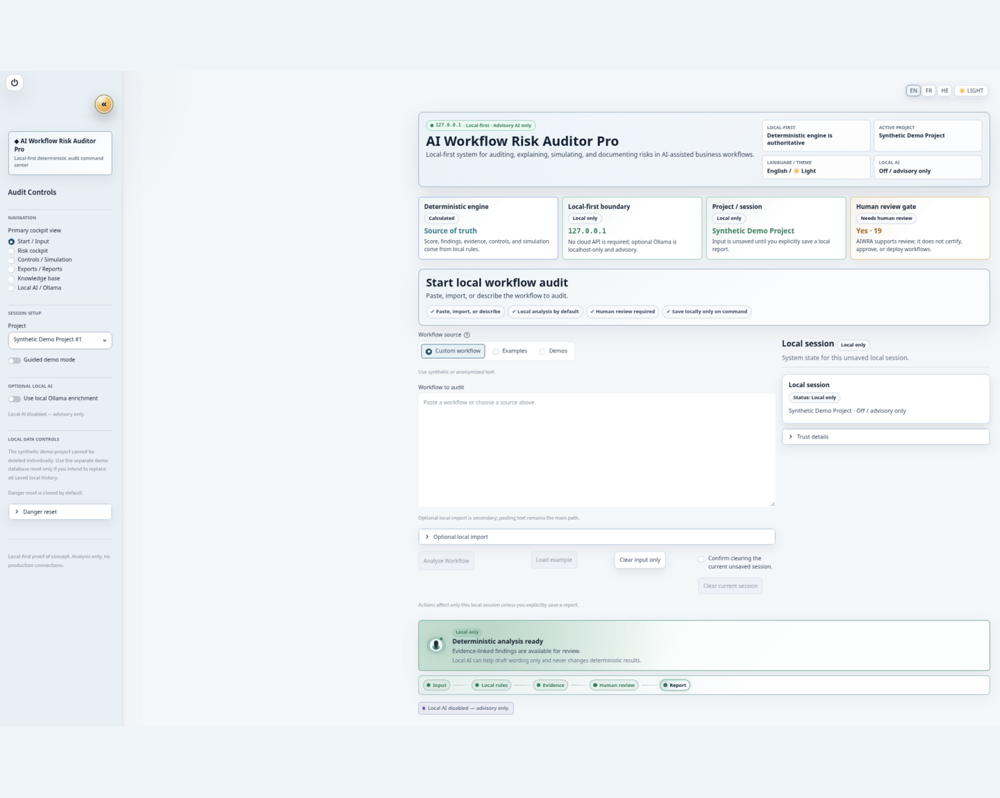

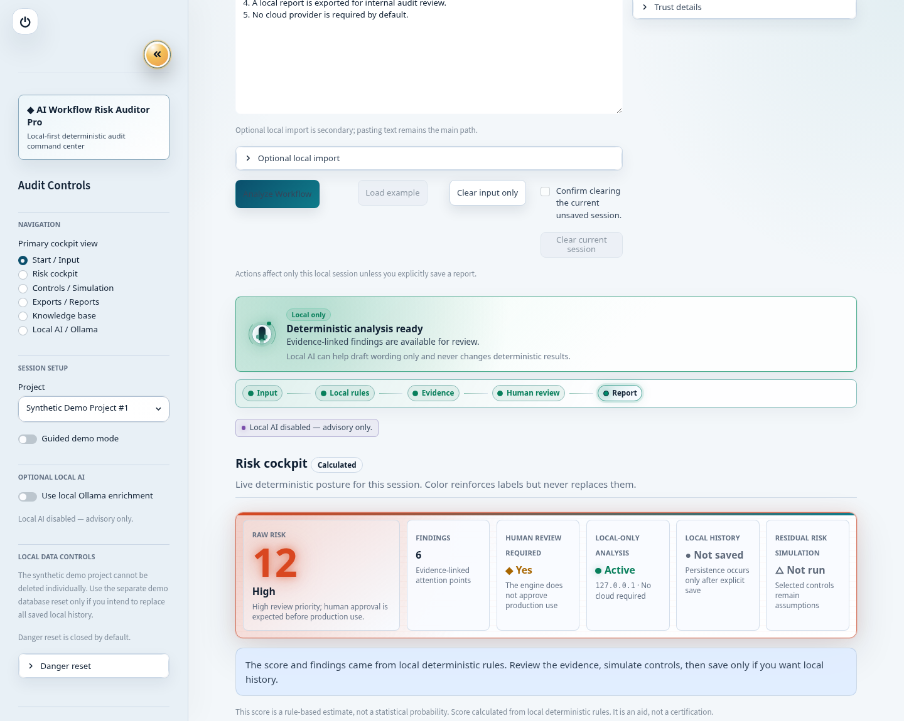

### Dashboard, heatmap, and evidence

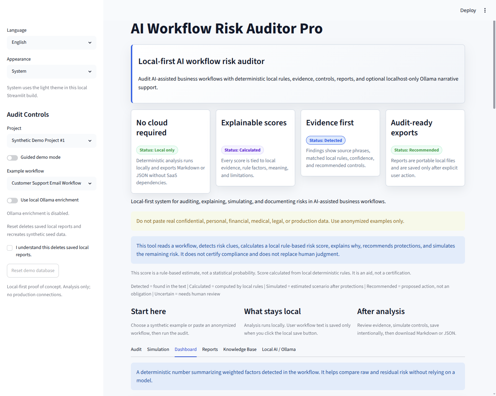

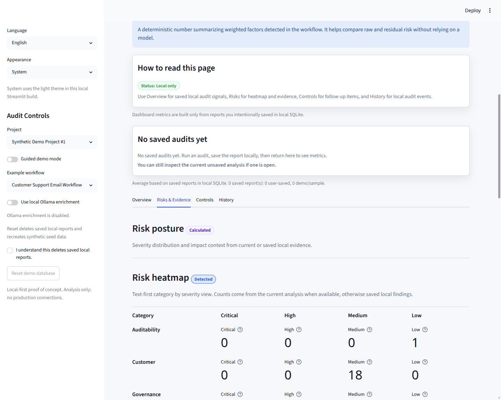

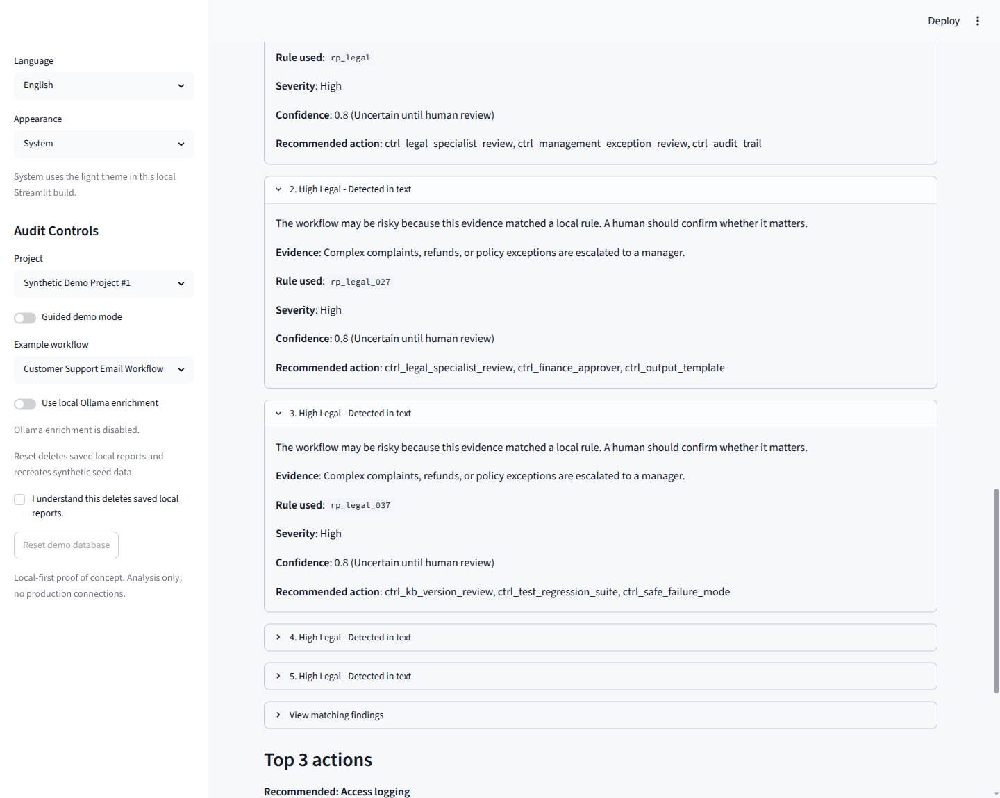

### Local AI, reports, and knowledge base

These are current private-review captures. The release checklist calls for stronger recaptures that show more tab-specific content before any public launch.

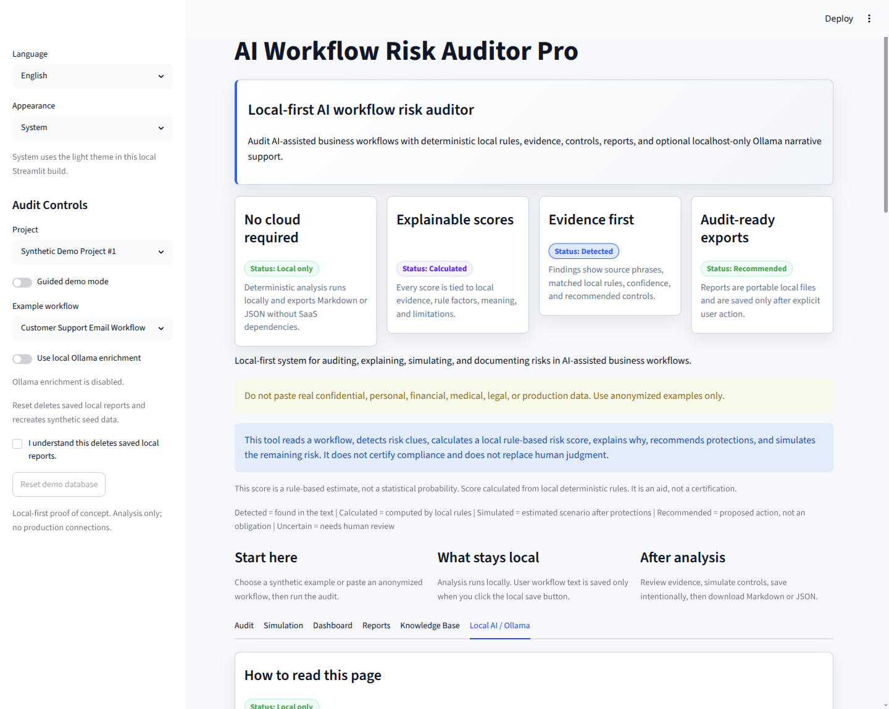

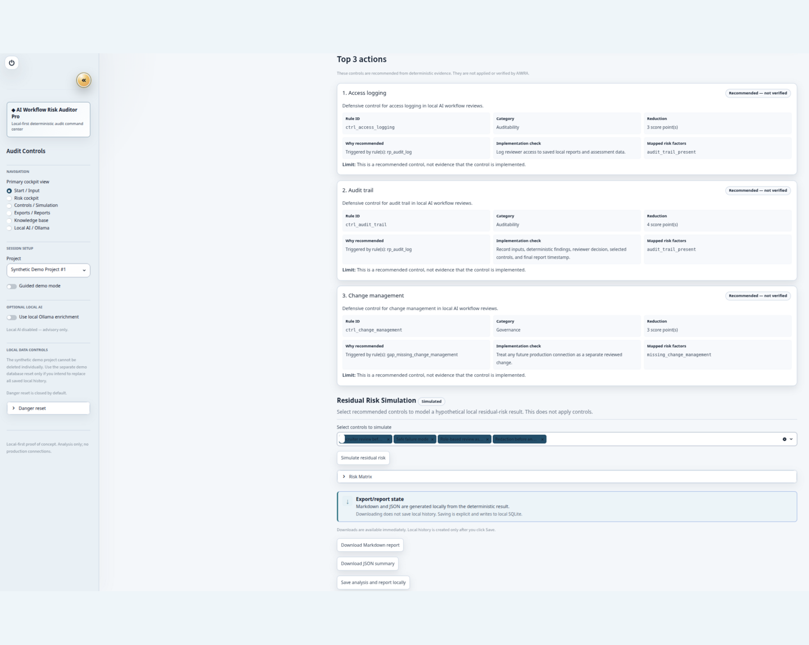

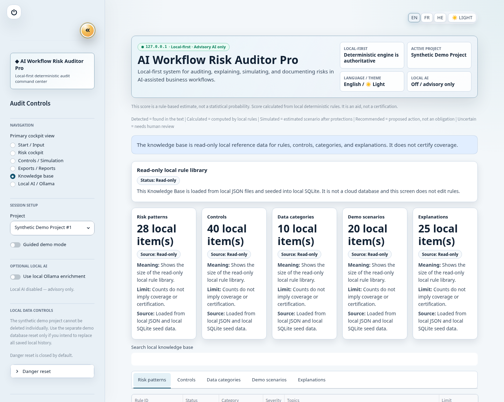

## Internationalization and RTL

English, French, and Hebrew locale catalogs have matching keys. Hebrew uses an RTL-aware layout while technical identifiers, JSON, model names, and endpoints remain LTR where appropriate.

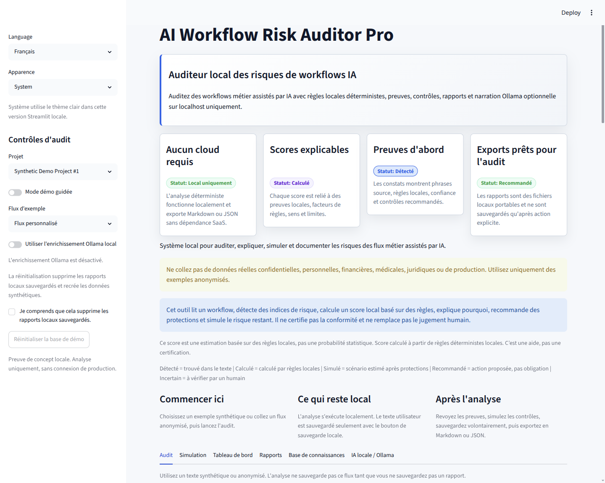

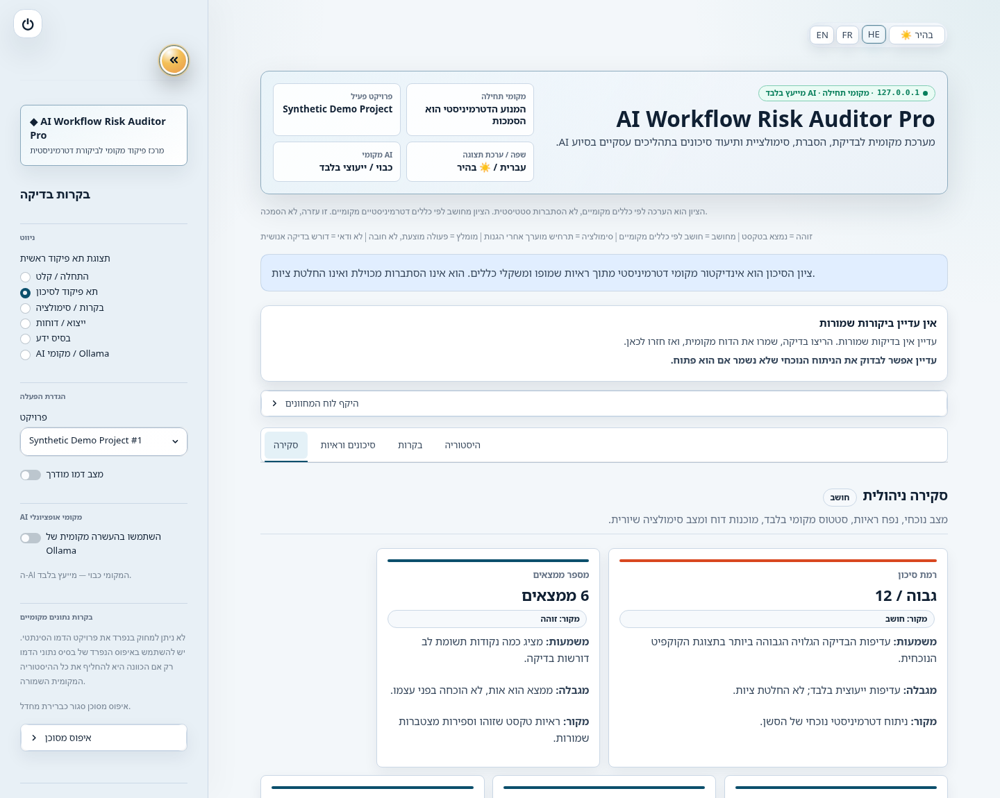

See [screenshot guidelines](docs/SCREENSHOT_GUIDELINES.md) for privacy checks and recommended recaptures.

## The problem

AI-assisted workflows can introduce sensitive-data exposure, weak human oversight, uncontrolled external actions, and poor auditability before a team connects anything to production. Reviewers need an understandable way to trace concerns back to workflow text and inspect the rules behind a score.

## What the tool does

- Parses synthetic or anonymized workflow descriptions into reviewable steps.
- Detects evidence with local JSON patterns and deterministic Python rules.
- Calculates fixed, explainable score factors and severity thresholds.
- Shows matched text, rule identifiers, confidence heuristics, and score impact.
- Recommends defensive controls and human checkpoints.
- Simulates residual risk from selected control mappings without changing the original result.
- Presents current or explicitly saved signals in a dashboard and risk heatmap.
- Generates local Markdown and JSON reports; saving to SQLite is explicit.
- Provides a read-only local knowledge base.
- Optionally uses a loopback-only Ollama model for narrative wording.

## What the tool does not do

- It does not certify compliance, provide legal advice, or approve production use.
- It does not calculate statistical probabilities or calibrated loss estimates.
- It does not prove that a recommended control is implemented or effective.
- It does not authenticate users, isolate tenants, or provide encrypted storage.
- It does not connect to production systems, execute actions, remediate findings, or scan for vulnerabilities.
- It does not require or fall back to a cloud model.

## Features

- **Deterministic scoring:** fixed local factor weights and thresholds.
- **Explainability:** source, meaning, and limitation for important scores and findings.
- **Evidence drill-down:** matched phrase, local rule, severity, confidence, and proposed action.
- **Control recommendations:** inspectable mappings to defensive controls and human review.
- **Residual-risk simulation:** before/after planning estimates from selected controls.
- **Dashboard:** executive cards, heatmap, matrix, workflow graph, controls, and local history.
- **Reports:** Markdown and JSON previews, downloads, and explicit-save local history.
- **SQLite persistence:** project-local `data/aiwra.db`, created at runtime and ignored by Git.
- **Knowledge Base:** read-only local rules, controls, data categories, scenarios, and explanations.
- **Optional local AI:** localhost-only Ollama narrative assistance that cannot change deterministic results.
- **Localization:** English, French, and Hebrew with RTL-aware Hebrew presentation.

## How scoring works

Matched evidence maps to fixed risk factors in `risk_rules.py`. The factor weights are summed and mapped to these review-priority thresholds:

- 0–4: Low
- 5–9: Medium
- 10–15: High
- 16+: Critical

Finding count is a count of detected attention points, not proof of harm. Confidence values are deterministic heuristics, not empirical confidence probabilities. Residual risk is a simulation of mapped control effects, not evidence that real-world risk was reduced.

See [Score Explainability](docs/SCORE_EXPLAINABILITY.md) and [Score Calculation Trace](docs/SCORE_CALCULATION_TRACE.md).

## Local-first privacy model

- Core analysis uses local Python modules and JSON knowledge files.
- Analysis does not automatically write workflow text to SQLite.
- Downloads are generated locally without creating saved history.
- Explicit saves write project, workflow, assessment, finding, control, report, and audit-event data to `data/aiwra.db`.
- No cloud API, vendor key, telemetry service, or external database is required.
- Optional Ollama requests accept only `localhost`, `127.0.0.1`, or `::1`; there is no cloud fallback.

Read the full [privacy model](docs/PRIVACY_MODEL.md) and [security policy](SECURITY.md).

## Architecture

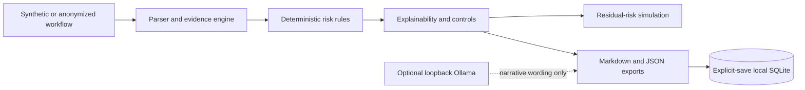

See [Architecture](docs/ARCHITECTURE.md) for module responsibilities, data flow, trust boundaries, and test design.

## Usage overview

1. Choose a bundled synthetic scenario or paste an anonymized workflow.
2. Select **Analyze Workflow**.
3. Review the raw score, severity, evidence, rules, confidence, and recommended controls.
4. Use **Simulation** to estimate residual risk from selected controls.
5. Download Markdown or JSON, or explicitly save the analysis to local history.
6. Explore **Dashboard**, **Reports**, **Knowledge Base**, or optional **Local AI / Ollama**.

The complete flow is in [Usage](docs/USAGE.md). Additional documentation is indexed in [docs/README.md](docs/README.md), and common questions are answered in the [FAQ](docs/FAQ.md).

## Testing and quality

```bash
python -m pytest
python -m compileall app.py analyzer.py database.py repositories.py workflow_parser.py report_renderer.py export_json.py score_explainability.py design_tokens.py ui_components.py tests locales
```

CI uses Python 3.12 and verifies tests, compilation, JSON parsing, and that common runtime/sensitive files are not tracked. Ollama, cloud APIs, credentials, and an existing database are not test prerequisites.

## Limitations and safe use

- Use synthetic or appropriately anonymized inputs. Do not paste real secrets, credentials, personal data, regulated records, or confidential production content.
- The tool is not legal advice and is not a compliance certification.
- Deterministic pattern matching can miss context or produce false positives.
- SQLite data is not encrypted by this application.
- The app has no multi-user authentication, authorization, or tenant isolation.
- Do not expose the Streamlit server to untrusted networks; bind it to `127.0.0.1` on a trusted machine.
- Optional local-model output may be inaccurate and always requires human review.
- Review reports and screenshots before sharing because they can reproduce entered workflow text.

## Project resources

- [Installation](docs/INSTALLATION.md)
- [Usage](docs/USAGE.md)
- [Architecture](docs/ARCHITECTURE.md)
- [Privacy model](docs/PRIVACY_MODEL.md)
- [FAQ](docs/FAQ.md)
- [Synthetic examples](examples/README.md)
- [Security policy](SECURITY.md)
- [Contributing guide](CONTRIBUTING.md)
- [Roadmap](ROADMAP.md)
- [Public release checklist](docs/PUBLIC_RELEASE_CHECKLIST.md)

## License

Released under a [source-available non-commercial license](LICENSE). See [NOTICE.md](NOTICE.md) and [Licensing and commercial use](docs/LICENSING_AND_COMMERCIAL_USE.md).

## Licensing and commercial use

AI Workflow Risk Auditor Pro is released under a source-available non-commercial license.

- License: [LICENSE](LICENSE)
- Notice: [NOTICE.md](NOTICE.md)
- Commercial-use details: [docs/LICENSING_AND_COMMERCIAL_USE.md](docs/LICENSING_AND_COMMERCIAL_USE.md)

Commercial use, hosted clones, redistribution, rebranding, and competing derivative products require prior written permission from GhostInTheShell-444.
