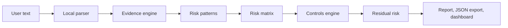

# Source Of Truth Map

Plain-language chain:

```text
User text
-> local parser
-> evidence engine
-> risk patterns
-> risk matrix
-> controls engine
-> residual risk
-> report/export/dashboard
```

Mermaid version:



## What Each Step Means

- User text: workflow text pasted by the user or selected from synthetic examples.
- Local parser: code splits and normalizes text on the local machine.
- Evidence engine: local rules look for evidence in workflow steps.
- Risk patterns: JSON rules in `knowledge_base/risk_patterns.json`.
- Risk matrix: deterministic calculation of raw score, severity, likelihood, impact, and confidence.
- Controls engine: maps findings to local controls from `knowledge_base/control_library.json`.
- Residual risk: local simulation after selected protections.
- Report/export/dashboard: generated from local analysis and saved only after explicit user action.

## What Is Not In The Chain

- No cloud API is required.
- No SaaS backend is added.
- No production workflow is contacted.
- No workflow text is sent outside localhost by the app.
- Optional Ollama enrichment is local-only and does not change scores.
